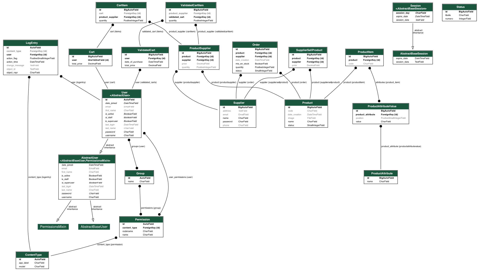

# TP_DJANGO

## Membre du groupe 

- Baptister Chédeville
- Amaël Masérati

## Vidéo de présentation

L'ensemble des vidéos de présentation se trouve dans le dossier data/video

### Présentation module Utilisateur :

[Voir la vidéo](https://youtu.be/6uI7kytMBr8)

[Voir la vidéo](https://youtu.be/gZ2G3y9t6ns)

### Présentation module Administateur :

[Voir la vidéo](https://youtu.be/3iy84kdouFU)

### Présentation module Fournisseur :

[Voir la vidéo](https://youtu.be/zedt2M-Edf0)

### Ajout d'un fournisseur et d'un produit :

[Voir la vidéo](https://youtu.be/ngLwlflaJ1E)

[Voir la vidéo](https://youtu.be/MBfxjqULw1k)

### Présentation de l'API :

[Voir la vidéo](https://youtu.be/Wtpsjav1vhI)


## Lancement du projet

Création de l'environnement virtuel et activation
```bash
python -m venv env
source env/bin/activate
```

Installation des dépendances
```bash
pip install -r requirements.txt
```

Faire les migrations
```bash
cd monprojet
python manage.py makemigrations
python manage.py migrate
```

Ajout du jeu de données dans la base de données depuis la racine du projet
```bash
cd monprojet
python manage.py loaddata data.json
```

Lancement du serveur depuis la racine du projet
```bash
cd monprojet
python manage.py runserver
```

## Comptes

- Admin : 
    - login : admin
    - password : admin

- Utilisateur :
    - login : Baptiste
    - password : b

    - Créer un compte pour tester les fonctionnalités de création de compte et de connexion

- Fournisseur :
    - login : Amazon
    - password : password

    - login : Fnac
    - password : password

    - login : Carrefour
    - password : password

## Fonctionnalités

- Création de compte
- Connexion
- Déconnexion
- A propos
- Contact

### Utilisateur

- Page des produits
- Page d'un produit
- Ajout d'un produit au panier
- Modification de la quantité d'un produit dans le panier
- Suppression d'un produit du panier
- Voir le panier
- Valider le panier
- Cout total du panier
- Historique des paniers
- Recherche d'un produit via le nom
- Affichage des stocks
- Gestion des stocks lors de la validation du panier (quantité restante)
- Controle de la quantité d'un produit lors de l'ajout au panier et de la validation du panier
- Affichage du prix minimum pour un produit
- Affichage des fournisseurs pour un produit et leur prix
- Visualisation d'un fournisseur et tous ses produits
- Visualisation des produits en rupture de stock
- Visualisation des produits en stock

### Administateur

- Gestion des produits (CRUD)
- Gestion des fournisseurs (CRUD)
- Recherche d'un fournisser via le nom
- Commande d'un produit pour un fournisseur
- Requête Javascript pour la commande d'un produit récupére les fournisseurs d'un produit sélectionné
- Visualisation des commandes (produit, fournisseur, quantité, date)
- Recherche d'une commande via le nom du produit ou du fournisseur
- Mise en stock d'un produit lors de la validation d'une commande (ajoute dans les stocks la quantité commandée)
- Visualisation des produits en rupture de stock
- Visualisation des produits en stock

### Fournisseur

- Gestion de ses produits qu'il vend (seul les produits qu'il vend peuvent être commandés par l'administateur)
- Ajout d'un produit qu'il vend
- Modification du prix d'un produit qu'il vend
- Suppression d'un produit qu'il vend
- Visualisation des produits qu'il vend
- Visualisation des commandes passées par l'administateur pour ses produits
- Marquage d'une commande comme expédiée et livrée

### API 

- API avec le framework Django Rest Framework
- Visualisation des produits (GET, POST, PUT, DELETE)
- Visualisation des fournisseurs (GET, POST, PUT, DELETE)
- Visualisation des commandes (GET, POST, PUT, DELETE)
- Visualisation des stock (GET, POST, PUT, DELETE)
- Visualisation des statuts de commande (GET, POST, PUT, DELETE)
- Visualisation des produits vendus par un fournisseur (GET, POST, PUT, DELETE)

## Tests unitaires

On se rend dans le dossier monprojet et on lance la commande suivante pour lancer les tests unitaires
```bash
./manage.py test monapp.tests
```

Affichage du coverage
```bash
coverage run --source='monapp' manage.py test monapp.tests && coverage report -m     
```

## MCD

Génération du MCD avec l'outil [Graphviz](https://graphviz.org/) dans le fichier data/MCD.png


